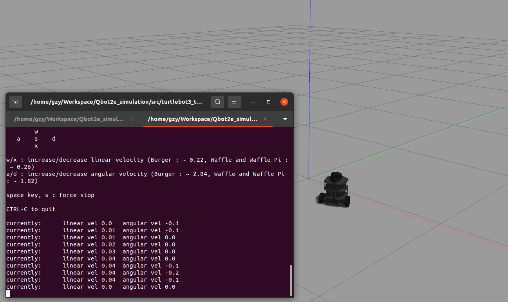
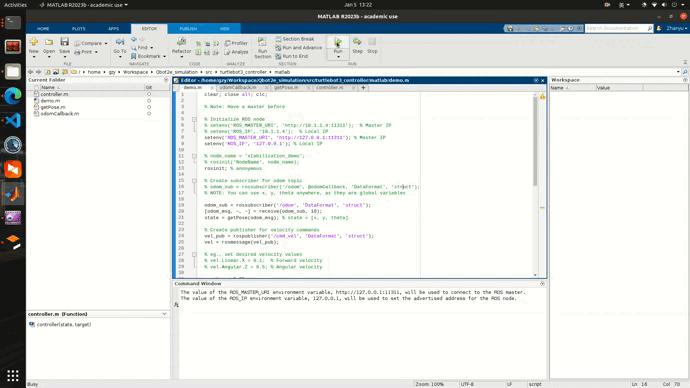
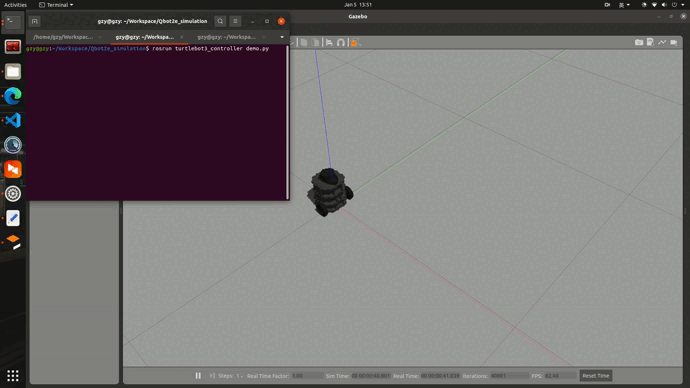

# Qbot2e Simulation

## Quick Start

1. Download the repo.
    ```bash
    git clone https://github.com/ZhanyuGuo/Qbot2e_simulation
    ```

2. Compile.
    ```bash
    cd <your_path>/Qbot2e_simulation/
    catkin_make
    ```

3. Config the env.
    ```bash
    # Do it in each new terminal
    cd <your_path>/Qbot2e_simulation/
    source devel/setup.bash
    export TURTLEBOT3_MODEL=burger  # options: burger, waffle, waffle_pi

    # Or add above two lines in the end of ~/.bashrc
    nano ~/.bashrc
    # add: source <your_path>/Qbot2e_simulation/devel/setup.bash
    # add: export TURTLEBOT3_MODEL=burger
    # ctrl + X and Enter Y to save
    
    # Then
    source ~/.bashrc
    # Or open a new terminal
     ```

4. Run robot in a empty gazebo world.
   ```bash
   roslaunch turtlebot3_gazebo turtlebot3_empty_world.launch

   # In a new terminal, use the keyboard to control it
   roslaunch turtlebot3_teleop turtlebot3_teleop_key.launch

   # NOTE: you have to source and export again if you have not modified the ~/.bashrc
   ```



## Details

1. Use `rostopic list`, we get the followings
    ```bash
    /clock
    /cmd_vel
    /gazebo/link_states
    /gazebo/model_states
    /gazebo/parameter_descriptions
    /gazebo/parameter_updates
    /gazebo/performance_metrics
    /gazebo/set_link_state
    /gazebo/set_model_state
    /imu
    /joint_states
    /odom
    /rosout
    /rosout_agg
    /scan
    /tf
    ```

    Note that `/cmd_vel` is the control input and `/odom` is the localization, they are the same topics we encounter in MATLAB, i.e., `/mobile_base/commands/velocity` and `/odom`.

2. Use MATLAB-ROS to control it!
   1. Requirements: `ROS Toolbox`.

   2. Launch the robot.
        ```bash
        roslaunch turtlebot3_gazebo turtlebot3_empty_world.launch
        ```

   3. Run `src/turtlebot3_controller/src/matlab/demo.m`.



3. Use Python-ROS to control it!
   1. Requirements: `numpy`.

   2. Launch the robot.
        ```bash
        roslaunch turtlebot3_gazebo turtlebot3_empty_world.launch
        ```
    
    3. Run controller.
        ```bash
        rosrun turtlebot3_controller demo.py
        ```


